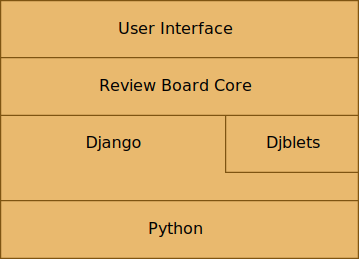
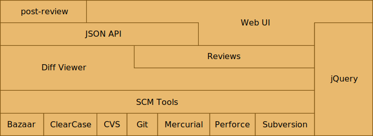
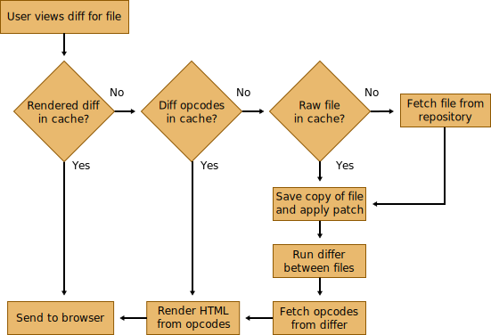

==========
Cover Page
==========

.. is:blank
.. is:id coverpage

Review Board

Christian Hammond - chipx86@chipx86.com

======================
A little background...
======================

* Written by Christian Hammond and David Trowbridge in 2006

* Developed as an experiment

* Wrote it to improve upon traditional code review

* Didn't plan on it becoming as large as it is today

* First experience with large-scale webapps and Django

=======================
Traditional code review
=======================

* E-mail raw or HTML diffs to reviewers

* Time-consuming

* Not always easy to describe *where* in a diff to make changes

* Hard to review iterations of large diffs

* Hard to keep track of review history for a change

=====
Goals
=====

* Provide as much context as possible

* Inline commenting

* Keep discussions all together

* Quick glance at what needs reviewing

* Not too much UI

* Extensibility

================
Ended up with...
================

* One of the most well-known open source code review systems

* Awesome features

  * A powerful diff viewer

  * Customizable dashboard for incoming and outgoing review requests

  * Full history of all reviews

  * Full-text search

  * Screenshot commenting support

  * Integration with third-party tools

* Many satisfied users across hundreds of companies

============================
Companies using Review Board
============================

.. is:id company_names

===========================
Some details and statistics
===========================

* Open source, under the MIT license

* Written in Python using Django, Djblets and jQuery

* Over 3 years in development

* 2 lead developers

* 140 contributors (and rising)

* Almost 700 people on the mailing list

=======================
Tools and services used
=======================

* **Code review:** Review Board (dogfood is yummy)

* **Nightly builds:** BuildBot (with custom extensions) on VMware ESXi

* **Bug tracker:** Google Code

* **Mailing lists:** Google Groups

* **Sourcecode Repository:** Git on GitHub

  * Used to use Subversion, but Git has many advantages for us and our users

==================
Basic architecture
==================

=====================
Detailed architecture
=====================

=================
View diff process
=================

==========
Challenges
==========

* Expensive (hosting costs and hardware)

* Time-consuming (development, testing, support)

* Hard problems to solve

  * Scalability

  * New ways to improve code review

  * Testing with a variety of repositories and browsers

  * Keeping it simple and usable

* User expectations

  * Bombarded with feature requests

  * Have to pick and choose, which may mean losing customers

..
    : "Some of our best features aren't well known..."

=====================
Lesser-known features
=====================

* Dashboard customization

* Screenshot commenting

* Diff viewer keyboard shortcuts

* Automatic linking

* post-review

* Reports

* Default Reviewers

* Web API

* Trophies

=======================
Dashboard customization
=======================

.. image:: ../../graphics/screenshots/2010/dashboard_customization.png

.. is:offset_x +40
.. is:offset_y -200

* Drag columns to rearrange them

* Primary and secondary column sorting

* Add new columns

* Remove columns you don't want

* Auto-saves your column setup in the database

=====================
Screenshot commenting
=====================

* Click and drag on a screenshot to leave a comment

* Works just like comments on the diff viewer

.. image:: ../../graphics/screenshots/2010/screenshot-comment-dlg.png

==============================
Diff viewer keyboard shortcuts
==============================

::

    a A K P < m   - Previous file
    f F J N >     - Next file
    s S k p ,     - Previous diff
    d D j n .     - Next diff
    <Space>       - Recenter selection
    [ x           - Previous comment
    ] c           - Next comment

=================
Automatic linking
=================

* Link to pages, bugs, and other URLs easily

* Examples:

  * **URLs:** http://www.example.com/

  * **Review requests:** `/r/123`

  * **Diffs:** `/r/123/diff`, `/r/123/diff/2/`

  * **Bug numbers:** `Bug #123`, `Bug 123`, `Issue #123`

* Works in the Description and Testing Done fields, and in reviews

===========
post-review
===========

* Command line script to create and update review requests.

* Generates the diff files for you and uploads them in one go.

* Easy to use!

* Examples:

  * Create a new review request::

      $ post-review

  * Update an existing review request::

      $ post-review -r 42

  * Post specific files::

      $ post-review src/foo.c src/bar.c

=======
Reports
=======

* http://reviewboard.example.com/reports/

* Text and wiki-formatted lists of reviews given and review requests posted
  in a specified time-frame.

* Useful for pasting into status reports.

* Defaults to a week. Append ?period=<number of days> to change this.

* Very basic. Hidden for a reason.

* Plan to improve this as an extension in 2.0.

=================
Default reviewers
=================

* Define default reviewers for all new review requests based on repository
  and file path

* Useful for placing feature owners on all review requests touching their
  feature

* Must be set by adminstrators

=======
Web API
=======

* Write client applications that talk to Review Board

* Can do *almost* everything the Review Board web UI can do

* HTTP GET/POST with JSON responses

* Future versions will be more REST-ful.

* Examples of existing clients:

  * post-review

  * Eclipse IDE plugin

  * Subversion, Git and Perforce post-commit hooks

  * Mercurial's ``hg postreview``

  * Perl WebService::ReviewBoard module

========
Trophies
========

* Certain review requests get special trophies! We'll let you figure out
  which.

* First trophy appears on the 1000th review request.

.. image:: ../../graphics/screenshots/2010/milestone-trophies.png

.. image:: ../../graphics/screenshots/2010/fish-trophies.png

========================
Upcoming features in 1.5
========================

* Update notifications

* HTML e-mails

* Improved auto-complete

* Screenshot upload via drag-and-drop

* Whitespace visibility toggling in the diff viewer

* Move detection

* Function/class headers for diffs

====================
Update notifications
====================

* See when someone updated a review request, diff, or commented

* No need to reload periodically

* Non-intrusive

.. image:: ../../graphics/screenshots/2010/notifications.png

============
HTML e-mails
============

* Looks just like the review requests page

* Diff fragments are shown with the comments

* Screenshot thumbnails are shown

* Falls back to plain-text on clients without HTML e-mails

* Works well with most major e-mail clients

.. is:offset_y -30

.. image:: ../../graphics/screenshots/2010/html-emails.png

======================
Improved auto-complete
======================

* Auto-complete now matches first names and last names for reviewers

* No more having to remember usernames

.. image:: ../../graphics/screenshots/2010/autocomplete.png

===================================
Screenshot upload via drag-and-drop
===================================

.. comment: TODO: Screenshot

* Drag screenshots from the file manager into the review request to upload

* Requires Google Chrome or Google Gears right now

* By 1.5 beta 1, will require modern browsers using HTML 5

==============================
Whitespace visibility toggling
==============================

* Show or hide lines containing only whitespace changes

* Can make changes with lots of whitespace removal easier to review

* Toggle instantly in the diff viewer

==============
Move detection
==============

* Shows when lines moved within a file

* Click the tag next to the line to jump to the old/new location

* Google Summer of Code 2009 project by Eduardo Felipe Castegnaro

.. image:: ../../graphics/screenshots/2010/move-detection.png

======================
Function/class headers
======================

.. image:: ../../graphics/screenshots/2010/function-headers.png

* See what function/class is defined before a collapsed region

* Also shown in comments on a review and in HTML e-mails

* Makes it easier to know where you are without expanding a diff

* Supports C, C++, C#, Objective-C, Java, JavaScript, Perl, Python, Ruby,
  and PHP

* In the future, plans to add an Expand to Function link

==========================
Features planned after 1.5
==========================

* Inline help/tips

* Attach files to review requests

* Incremental expansion of diffs

* Gravatars

* WebHooks

* Policy support

* Extensions

================
Inline help/tips
================

* Dismissable tip banners for new features or new users

* Help icons/buttons that link to the proper documentation

* Would have been useful for some of the lesser-known features
  (diff viewer keyboard shortcuts)

* Planned for 1.6

===============================
Attach files to review requests
===============================

* Attach files other than screenshots

* Useful for spreadsheets, log files, extra images, sample data, and more

* Use the web UI or post-review to attach files

* Administrator-provided file size limits

* Planned for 1.6

==============================
Incremental expansion of diffs
==============================

* Expand 5 lines, 10 lines, 20, or more

* Expand up to the nearest function or class

* Undo the last or all expansions

* Planned for 1.6

=========
Gravatars
=========

* "Globally-recognized avatars"

* Users can set an image representing them that will appear in the UI next
  to their name

* Easier way to identify people

* Planned for 1.6

========
WebHooks
========

* Better integrate Review Board with third-party services/scripts

* Review Board will make an HTTP POST on several events:

  * Creating/updating a review request

  * Closing a review request

  * Posting a review

  * Replying to a review

* Lots of uses

  * Update bug reports when creating or closing a review request

  * Running sandbox builds with new diffs

  * Notifying users on updates over an internal service (such as identi.ca)

* Shipping in 1.6.

==============
Policy support
==============

* Finer-grained control of a Review Board installation

* Administrators can specify:

  * Who can join or browse groups

  * Who can look at code in a repository, per-path

  * How many or which reviewers must review changes to a group

* Policy rules can be written with flexible expressions

  * Extensions can extend the policy expression language

  * Use expressions to tie rules into company-specific services

* Planned for 2.0

==========
Extensions
==========

* Custom Python code that can extend the functionality of Review Board

* Extension capabilities:

  * Override/augment page content

  * Access to internal logic and data

  * Provide new web API

  * Provide new settings or administration capabilities

  * Add columns and sidebar entries to the dashboard

  * Hook into events (Review Board initialization, creating review requests,
    reviews, and more)

* Administrators will be able to download and install extensions through an
  integrated App Store-style browser

* Planned for 2.0

================
Looking for help
================

* Donations

* Code contributions

* Documentation

* Testing

* Support

=====================
Thanks for listening!
=====================

Any questions?
