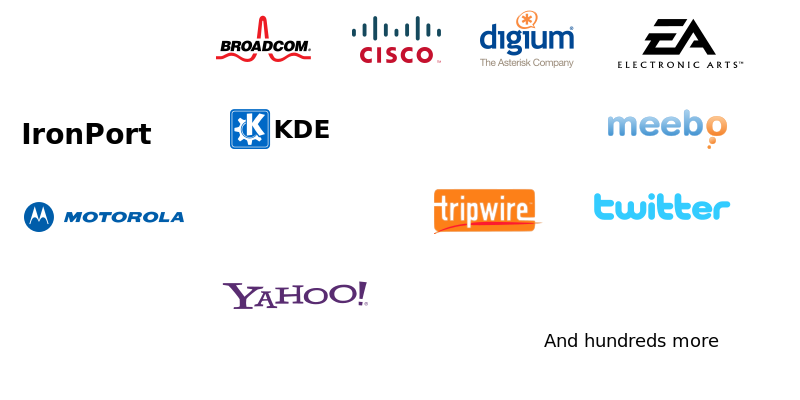
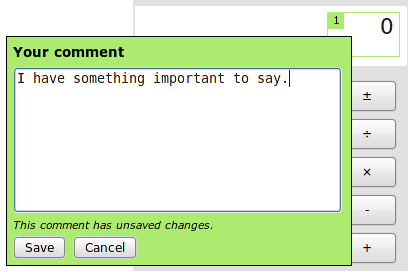
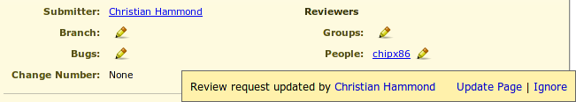
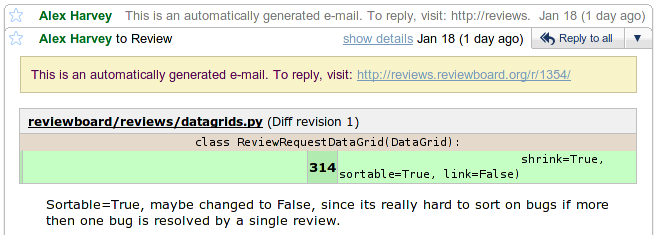
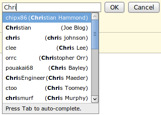
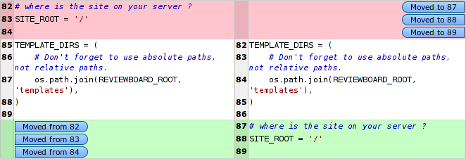
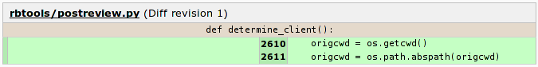

======================
A little background...
======================

* Wrote it to improve upon traditional code review

* First experience with large-scale webapps and Django

* Developed as an experiment

* Didn't plan on it becoming as large as it is today

=======================
Traditional code review
=======================

* E-mail raw or HTML diffs to reviewers

* Not always easy to describe *where* in a diff to make changes

* Hard to review iterations of large diffs

* Hard to keep track of review history for a change

* Time-consuming

================
Ended up with...
================

* One of the most well-known open source code review systems

* Awesome features

  * A powerful diff viewer

  * Customizable dashboard for incoming and outgoing review requests

  * Full history of all reviews

  * Full-text search

  * Screenshot commenting support

  * Integration with third-party tools

* A lot of users

============================
Companies using Review Board
============================

===========================
Some details and statistics
===========================

* Open source, under the MIT license

* Written in Python using Django, Djblets and jQuery

* Over 3 years in development

* 2 lead developers

* 140 contributors (and rising)

* Almost 700 people on the mailing list

=======================
Tools and services used
=======================

* **Code review:** Review Board (dogfood is yummy)

* **Nightly builds:** BuildBot (with custom extensions) on VMware ESXi

* **Bug tracker:** Google Code

* **Mailing lists:** Google Groups

* **Sourcecode Repository:** Git on GitHub

  * Used to use Subversion, but Git has many advantages for us and our users

==========
Challenges
==========

* Expensive (hosting costs and hardware)

* Time-consuming (development, testing, support)

* Hard problems to solve

  * Scalability

  * New ways to improve code review

  * Testing with a variety of repositories and browsers

  * Keeping it simple and usable

* User expectations

  * Bombarded with feature requests

  * Have to pick and choose, which may mean losing customers

..
    : "Some of our best features aren't well known..."

=====================
Lesser-known features
=====================

* Dashboard customization

* Screenshot commenting

* Reports

* post-review

* Trophies

=======================
Dashboard customization
=======================

.. image:: ../../graphics/screenshots/2010/dashboard_customization.png

.. is:offset_x +40
.. is:offset_y -200

* Drag columns to rearrange them

* Primary and secondary column sorting

* Add new columns

* Remove columns you don't want

* Auto-saves your column setup in the database

=====================
Screenshot commenting
=====================

* Click and drag on a screenshot to leave a comment

* Works just like comments on the diff viewer

=======
Reports
=======

* http://reviewboard.example.com/reports/

* Text and wiki-formatted lists of reviews given and review requests posted
  in a specified time-frame.

* Useful for pasting into status reports.

* Defaults to a week. Append ?period=<number of days> to change this.

* Very basic. Hidden for a reason.

* Plan to improve this as an extension in 2.0.

===========
post-review
===========

* Command line script to create and update review requests.

* Generates the diff files for you and uploads them in one go.

* Easy to use!

.. is:offset_x +25
.. is:offset_y +30

Create a new review request::

  $ post-review

Update an existing review request::

  $ post-review -r 42

Post specific files::

  $ post-review src/foo.c src/bar.c

========
Trophies
========

TODO

========================
Upcoming features in 1.5
========================

* Update notifications

* HTML e-mails

* Improved auto-complete

* Screenshot upload via drag-and-drop

* Whitespace visibility toggling in the diff viewer

* Move detection

* Function/class headers for diffs

====================
Update notifications
====================

* See when someone updated a review request, diff, or commented

* No need to reload periodically

* Non-intrusive

============
HTML e-mails
============

* Looks just like the review requests page

* Diff fragments are shown with the comments

* Screenshot thumbnails are shown

* Falls back to plain-text on clients without HTML e-mails

* Works well with most major e-mail clients

.. is:offset_y -30

======================
Improved auto-complete
======================

* Auto-complete now matches first names and last names for reviewers

* No more having to remember usernames

===================================
Screenshot upload via drag-and-drop
===================================

.. comment: TODO: Screenshot

* Drag screenshots from the file manager into the review request to upload

* Requires Google Chrome or Google Gears right now

* By 1.5, will support modern browsers using HTML 5

==============================
Whitespace visibility toggling
==============================

* Show or hide lines containing only whitespace changes

* Can make changes with lots of whitespace removal easier to review

* Toggle instantly in the diff viewer

==============
Move detection
==============

* Shows when lines moved within a file

* Click the tag next to the line to jump to the old/new location

* Google Summer of Code 2009 project by Eduardo Felipe Castegnaro

======================
Function/class headers
======================

* See what function/class is defined before a collapsed region

* Also shown in comments on a review and in HTML e-mails

* Makes it easier to know where you are without expanding a diff

* Supports C, C++, C#, Objective-C, Java, JavaScript, Perl, Python, Ruby,
  and PHP

* In the future, plans to add an Expand to Function link
