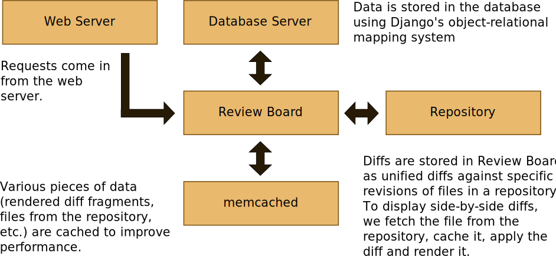
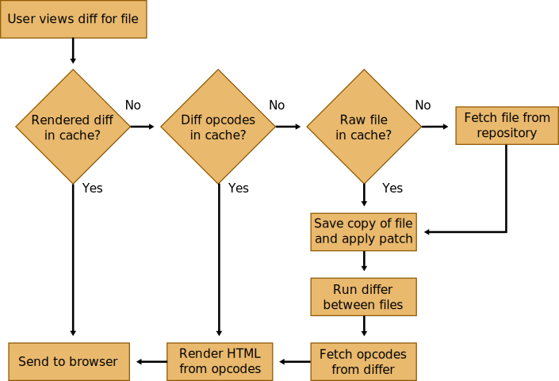
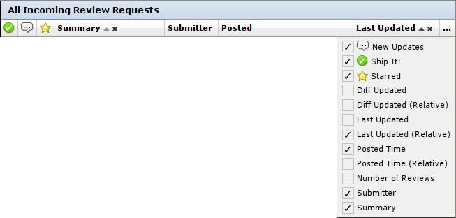
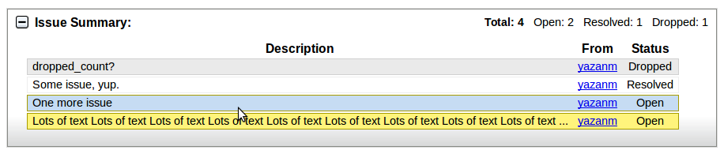
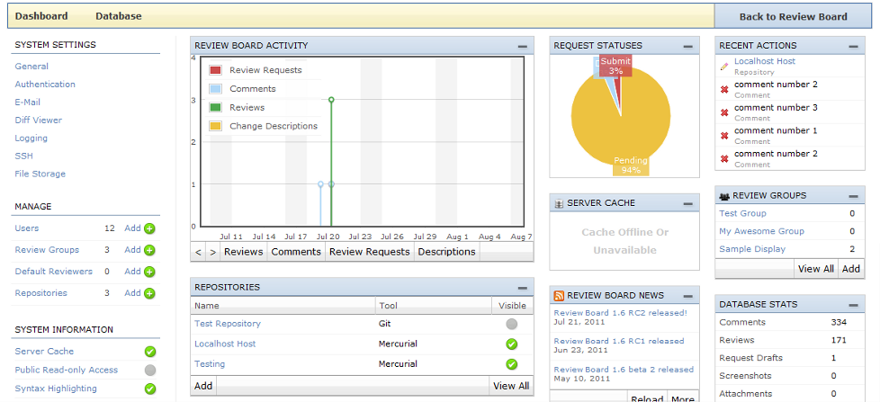

==========
Cover Page
==========

.. is:blank
.. is:id coverpage

Review Board

Christian Hammond - chipx86@chipx86.com
David Trowbridge - trowbrds@gmail.com

======================
A little background...
======================

* Written by Christian Hammond and David Trowbridge in 2006

* Developed as an experiment

* Wrote it to improve upon traditional code review

* Didn't plan on it becoming as large as it is today

* First experience with large-scale webapps and Django

=======================
Traditional code review
=======================

* E-mail raw or HTML diffs to reviewers

* Time-consuming

* Not always easy to describe *where* in a diff to make changes

* Hard to review iterations of large diffs

* Hard to keep track of review history for a change

=====
Goals
=====

* Provide as much context as possible

* Inline commenting

* Keep discussions all together

* Quick glance at what needs reviewing

* Not too much UI

* Extensibility

===========================
Some details and statistics
===========================

* Open source, under the MIT license

* Written in Python using Django, Djblets and jQuery

* Almost 5 years in development

* 3 lead developers

* 170 contributors (and rising)

* Student participation

  * Google Summer of Code

  * UCOSP

=====================
Architecture Overview
=====================

* Django and LAMP

* Basic architecture

* How the diff view works

* Myers Diff algorithm

* Full-text search

===============
Django and LAMP
===============

* Django is a web framework for Python

* Choice of deployment options

* Functionality is split up into "apps"

  * Models

  * Templates

  * Views

  * Other stuff (URLs, forms, admin)

==================
Basic Architecture
==================

=================
View diff process
=================

====================
Myers Diff algorithm
====================

* Turns diff into a graph search problem

  * Finds common subsequences, optimizing for length

  * Solves remaining differences to find fewest insert/delete blocks

* Additional heuristics borrowed from GNU diff

* O(ND) performance

================
Full-text search
================

* Built on top of PyLucene

  * Python frontend to JVM Lucene

* First full index

* Scheduled cron-job incremental indexes

=====================
Lesser-known features
=====================

* Dashboard customization

* Diff viewer keyboard shortcuts

* Automatic linking

* post-review

* Web API

* Trophies

* Default Reviewers

=======================
Dashboard customization
=======================

.. is:offset_y -175

* Drag columns to rearrange them

* Primary and secondary column sorting

* Add new columns

* Remove columns you don't want

* Auto-saves your column setup in the database

==============================
Diff viewer keyboard shortcuts
==============================

::

    a A K P < m   - Previous file
    f F J N >     - Next file
    s S k p ,     - Previous diff
    d D j n .     - Next diff
    <Space>       - Recenter selection
    [ x           - Previous comment
    ] c           - Next comment

=================
Automatic linking
=================

* Link to pages, bugs, and other URLs easily

* Examples:

  * **URLs:** http://www.example.com/

  * **Review requests:** `/r/123`

  * **Diffs:** `/r/123/diff`, `/r/123/diff/2/`

  * **Bug numbers:** `Bug #123`, `Bug 123` `Issue #123`

* Works in the Description and Testing Done fields, and in reviews

===========
post-review
===========

* Command line script to create and update review requests.

* Generates the diff files for you and uploads them in one go.

* Easy to use!

.. is:offset_x +25
.. is:offset_y +30

Create a new review request::

  $ post-review

Update an existing review request::

  $ post-review -r 42

Post specific files::

  $ post-review src/foo.c src/bar.c

=======
Web API
=======

* Write client applications that talk to Review Board

* Can do *almost* everything the Review Board web UI can do

* Fully REST (and we really do mean it)

* Supports both XML and JSON formats

* Examples of existing clients:

  * post-review

  * Eclipse IDE plugin

  * Subversion, Git and Perforce post-commit hooks

  * Mercurial's ``hg postreview``

  * Perl WebService::ReviewBoard module

========
Trophies
========

* Certain review requests get special trophies! We'll let you figure out
  which.

* First trophy appears on the 1000th review request.

=================
Default Reviewers
=================

* Automatically assign users and groups to review requests

* Rules match filenames in the diff with a regexp

* Can apply to all repositories or just one

========================
Features planned for 1.7
========================

* Issue summary table

* New Admin UI

* Less space for diff storage

* Extensions (preview)

===================
Issue Summary Table
===================

* Building on Issue Tracking support that shipped with 1.6

.. is:offset_y +50

============
New Admin UI
============

===========================
Less space for diff storage
===========================

* Multiple diff revisions end up wasting space

* Hash each filediff and only store once

==========
Extensions
==========

* Third-party installable packages can hook into Review Board

  * Add new UI elements

  * Add REST WebAPIs

  * Connect handlers for events

  * Add new dashboard widgets for the Admin UI

  * Versioned and installed outside of the Review Board tree

  * Automatically shows up in the list of extensions when installed.

* 1.7 will be an unstable API

* 2.0 will have a final, documented API

========================
Many uses for extensions
========================

* Bug tracker integration

* Automatically run tests on new changes

* Automated reviewing for lintian and style checks

* Custom review UIs for non-diff files

* Statistics and reporting

* New ways to notify on review request updates

* Show restaurant recommendations after long review cycles

==========================
Writing extensions is easy
==========================

* Packages as Python eggs

* Simple classes based around defining "hooks"

::

    class ReportsExtension(Extension):
        def __init__(self):
            super(MyExtension, self).__init__()

            self.hooks = [
                DashboardHook(self, [{
                    'label': 'Reports',
                    'url': 'reports/',
                }]),
                URLHook(self, patterns('',
                    (r'^reports/',
                     include('rbreports.urls')))),
            ]

=====================
Thanks for listening!
=====================

Any questions?
